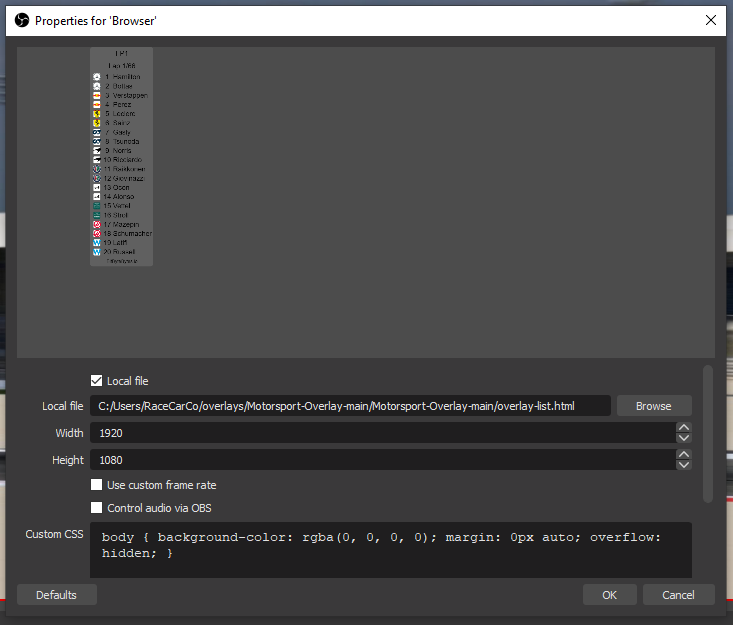
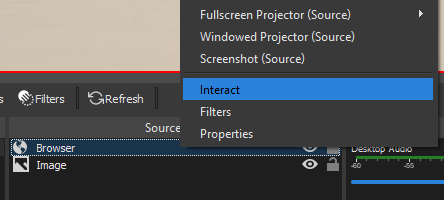

# Motorsport-Overlay
HTML based overlay for broadcasting applications that displays a manually updatable lap counter and driver position list.

### Developed and tested with [OBS](https://obsproject.com) 26.1.1 (64bit)

#### There are currently two variations

#### and

### To display this overlay in OBS:

- download the zip file

- extract to the location of your choice, but keep everything in the folder it extracts to

- create a `Browser Source` for your scene in OBS
- make sure it is on top of the capture source (above it in the list)
- make sure the layer isn't hidden (click the eye icon to hide/show)

- in the settings for the Browser Source click "local file"
- point OBS to `overlay-list.html` in the folder that was extracted in step two
- set the height and width to the same values as the Base Resolution for the scene

- you should see a preview of the overlay in the Browser Source settings panel
- if not, you need to _**uncheck**_ `Enable Browser Source Hardware Acceleration` in settings > advanced settings > sources

### to interact with the layer:

- right click on the Browser Source and choose `interact`

- a window will open displaying the overlay

#### in the `Interacting with 'Browser'` window: 
- clicking on the current lap will increment the lap counter by one lap
- clicking on the total laps will decrement the lap counter by one lap
- clicking on a driver's icon will move them up in the order by one
- clicking on a driver's name will move them down in the order by one
